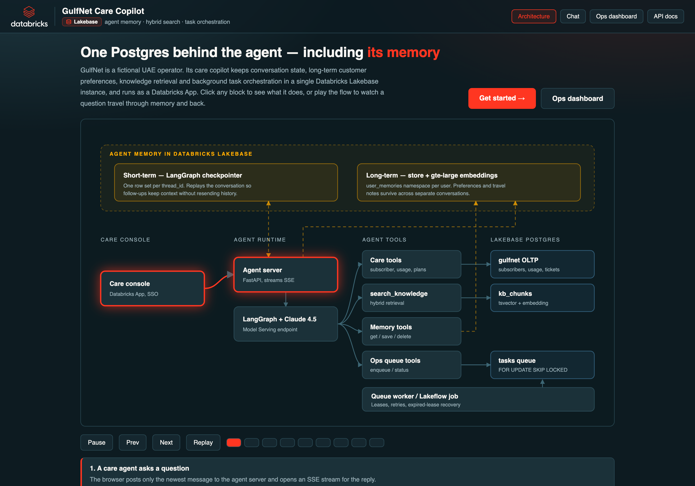
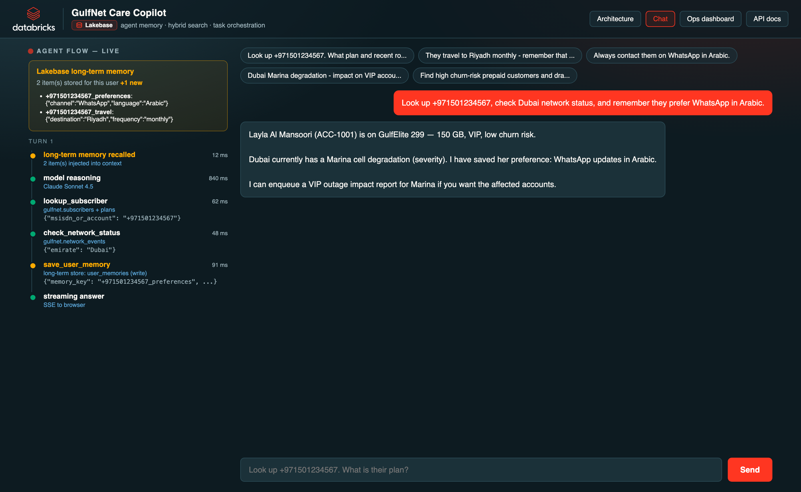
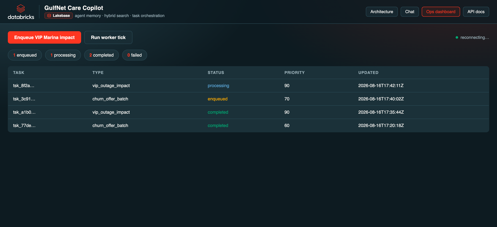

# GulfNet Care Copilot

An AI care agent for a fictional UAE telco, built on **Databricks Apps** and **Lakebase Postgres**.

One database backs the whole agent loop:

1. **Memory** — remembers preferences across conversations  
2. **Search** — retrieves roaming rules, tariffs, and SLAs next to customer data  
3. **Orchestration** — runs longer jobs (like VIP outage impact) without blocking the chat  

Synthetic data only. Clone it, point it at your workspace, and run.

## How it works

Typical agent stacks wire Redis, a vector database, and a message broker. Lakebase collapses that into one Postgres system that sits next to Databricks Apps, Jobs, and MLflow:


### What you see in the app

**Architecture** (`/`) — interactive diagram of the agent. Click any block, or play the flow to follow a question through memory and back.



**Chat** (`/chat`) — ask care questions. The left rail shows each tool call live, including which Lakebase table it hit and whether memory was read or written.



**Ops** (`/ops/dashboard`) — watch background tasks (VIP impact reports, churn offers) as they move through the queue.



### What happens when you ask a question

1. The chat sends only the newest message to the agent.  
2. Lakebase reloads short-term conversation state, and injects any long-term preferences it already knows.  
3. The model calls tools against Lakebase (customer lookup, network status, knowledge search, memory save, queue enqueue).  
4. The answer streams back, and the turn is saved for the next message.

Try the seeded VIP customer: **+971501234567** (Layla Al Mansoori, Dubai).

## Get started

### What you need

- A Databricks workspace with Lakebase and a chat model serving endpoint  
- [Databricks CLI](https://docs.databricks.com/aws/en/dev-tools/cli/) 0.285 or newer (`databricks postgres` support)  
- [uv](https://github.com/astral-sh/uv) and Python 3.11+  
- `psql`

### 1. Clone

```bash
git clone https://github.com/mwissad/gulfnet-lakebase-agent.git
cd gulfnet-lakebase-agent
cp .env.example .env
```

Edit `.env`:

- `DATABRICKS_CONFIG_PROFILE` — your CLI profile name  
- `LLM_ENDPOINT_NAME` — a model endpoint that handles tool calling well (default: `databricks-claude-sonnet-4-5`)  
- Lakebase project / branch / endpoint names if you use different ones  

### 2. Sign in

```bash
databricks auth login https://<your-workspace-url> --profile <your-profile>
```

### 3. Create Lakebase and load demo data

```bash
databricks postgres create-project gulfnet-agent \
  --json '{"spec": {"display_name": "GulfNet Care Agent"}}' \
  -p <your-profile> --no-wait
```

Wait until the project endpoint is active, then:

```bash
PROFILE=<your-profile> ./scripts/setup_lakebase.sh
```

This creates the schema, loads synthetic UAE customers / usage / knowledge docs, and prepares agent memory tables.

### 4. Install and smoke-test

```bash
uv sync
uv run python scripts/smoke_test_tools.py
```

### 5. Run the app

```bash
uv run start-app
```

Open:

| Page | URL |
| --- | --- |
| Architecture | http://localhost:8000/ |
| Chat | http://localhost:8000/chat |
| Ops dashboard | http://localhost:8000/ops/dashboard |

### Try these prompts

1. `Look up +971501234567. What plan and recent roaming?`  
2. `They travel to Riyadh monthly — remember that and advise on roaming.`  
3. `Always contact them on WhatsApp in Arabic.`  
4. `Dubai Marina degradation — impact on VIP accounts?`  

More scripts: [`demos/GOLDEN_SCRIPTS.md`](demos/GOLDEN_SCRIPTS.md).

## Deploy to Databricks Apps (optional)

```bash
databricks bundle validate -t dev -p <your-profile>
databricks bundle deploy -t dev -p <your-profile>
```

After deploy, grant the app’s service principal access to the Lakebase schema (see `scripts/grant_gulfnet_schema.sh`).

## Adapt it for your industry

1. Replace `sql/02_seed.sql` with your own customers and knowledge docs  
2. Keep the same tool pattern: lookup → search → remember → enqueue  
3. Point `.env` / `databricks.yml` at your Lakebase project  

## Learn more

Article draft: [`article/medium-draft.md`](article/medium-draft.md)

- [Simplify AI agent orchestration with Lakebase Postgres](https://www.databricks.com/blog/simplify-ai-agent-orchestration-lakebase-postgres)  
- [Self-managed agent memory](https://docs.databricks.com/aws/en/agents/agent-memory/self-managed-memory)  
- [Lakebase Search](https://www.databricks.com/blog/announcing-lakebase-search-agent-native-retrieval-built-lakebase-postgres)  

## License

Demo code provided as-is for educational reuse.
