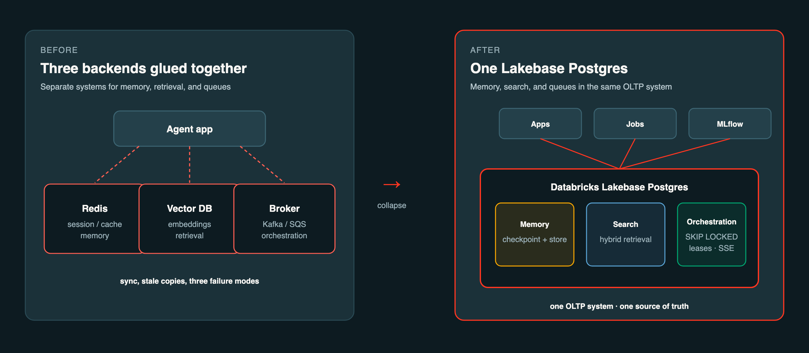
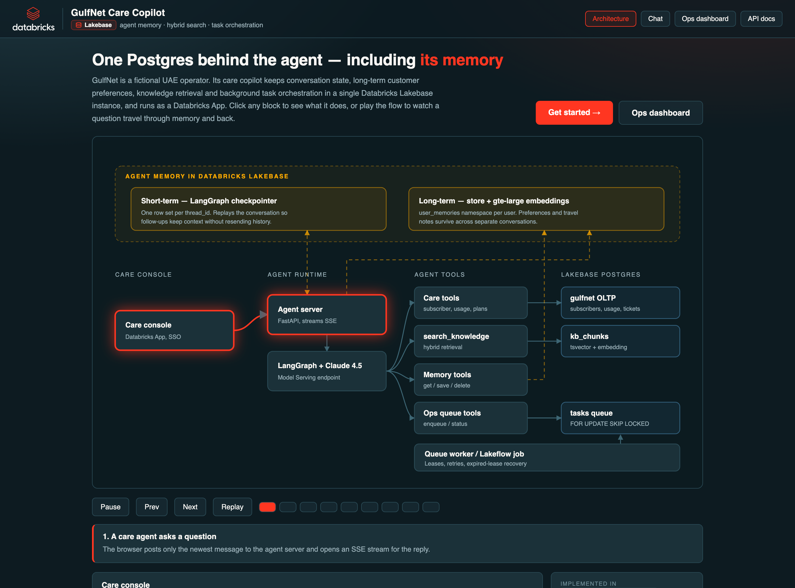

# One Postgres for the whole agent loop: memory, search, and orchestration for a UAE telco care agent on Databricks Lakebase

*How GulfNet Care Copilot uses Lakebase Postgres as the single backend for agent memory, hybrid retrieval, and durable task queues — with a reusable demo you can clone.*

---

## The problem telco care agents actually have

A UAE care agent helping a VIP customer does not need another chatbot demo. They need:

1. **Fresh context** — “prefers Arabic WhatsApp” written on turn 3 must be available on turn 4 and next week.
2. **Live policy retrieval** — roaming rules for Riyadh, VIP SLAs, 5G coverage notes, joined to the subscriber’s plan.
3. **Durable background work** — “Who are the VIP accounts impacted by Dubai Marina degradation?” cannot die when the HTTP request times out.

Most stacks glue together Redis, a vector DB, and a broker. [Lakebase Postgres](https://www.databricks.com/blog/simplify-ai-agent-orchestration-lakebase-postgres) collapses that loop onto one OLTP system that already lives next to Databricks Apps, Jobs, and MLflow.



*The whole agent loop — short/long-term memory, hybrid retrieval, and durable task queues — becomes three pillars inside one Postgres, instead of three backends you have to keep in sync.*

This article walks a fictional UAE operator — **GulfNet** — through that architecture. The full repo is open at **github.com/mwissad/gulfnet-lakebase-agent**.

---

## Architecture: one Lakebase, three pillars

The app ships with an interactive architecture page (its landing screen) that lets you click any block or play the request flow through memory and back. Here it is paused on the first step:



*The amber band is agent memory — short-term (LangGraph checkpointer) and long-term (store + embeddings) — living in the same Lakebase instance as the operational tables, knowledge chunks, and task queue.*

```
Databricks App (Care Copilot + Ops dashboard)
        │
        ▼
Lakebase Postgres ──┬── short/long-term agent memory (LangGraph checkpointer + store)
                    ├── hybrid knowledge search (kb_chunks + FTS / Lakebase Search)
                    └── tasks + task_attempts (Postgres queue)
                              │
                              ▼
                     Lakeflow Job / in-app worker
                     MLflow traces · UC Volumes (optional PDFs)
```

We map each pillar to a public Databricks post:

| Pillar | Capability | Reference |
|--------|------------|-----------|
| Memory | Self-managed short-term + long-term memory on Lakebase | [Self-managed agent memory](https://docs.databricks.com/aws/en/agents/agent-memory/self-managed-memory) |
| Search | Hybrid retrieval beside operational tables | [Lakebase Search](https://www.databricks.com/blog/announcing-lakebase-search-agent-native-retrieval-built-lakebase-postgres) |
| Orchestration | `FOR UPDATE SKIP LOCKED`, leases, priority, SSE | [Simplify AI agent orchestration](https://www.databricks.com/blog/simplify-ai-agent-orchestration-lakebase-postgres) |

---

## Pillar 1 — Memory that survives the session

GulfNet Care Copilot is a LangGraph agent on Databricks Apps. Short-term memory uses Lakebase-backed checkpointing (`AsyncCheckpointSaver`). Long-term memory uses `AsyncDatabricksStore` with tools:

- `get_user_memory` / `save_user_memory` / `delete_user_memory`

When a CSR says “Prefer WhatsApp updates in Arabic,” the agent writes a durable fact keyed by `user_id`. The next thread — even after App restart — can personalize VIP handling without re-asking.

This follows the [self-managed memory](https://docs.databricks.com/aws/en/agents/agent-memory/self-managed-memory) path: you own the schema and SQL, which is exactly what you want when memory must join to `subscribers` and tickets.

---

## Pillar 2 — Search next to the subscriber row

Tariffs, GCC roaming guides, VIP SLAs, and Arabic FAQs live in `gulfnet.kb_documents` / `kb_chunks`. The `search_knowledge` tool runs hybrid retrieval in Postgres (full-text today; [Lakebase Search](https://www.databricks.com/blog/announcing-lakebase-search-agent-native-retrieval-built-lakebase-postgres) `lakebase_vector` + `lakebase_text` when enabled).

Why this matters for agents: a write to memory or a new roaming bulletin is immediately queryable in the same database transaction boundary as OLTP — no export to a separate vector cluster. Agents treat search as an **operational** workload, not a stale snapshot.

Demo moment: “They’ll visit Riyadh next week” → retrieve KSA roaming packs → answer in context of Layla’s GulfElite 299 plan.

---

## Pillar 3 — Orchestration without Kafka

Long-running VIP impact analysis uses the CLA-style Postgres queue from the [orchestration blog](https://www.databricks.com/blog/simplify-ai-agent-orchestration-lakebase-postgres):

- `tasks` + `task_attempts`
- Concurrent dequeue with `FOR UPDATE SKIP LOCKED`
- Lease expiry for crash recovery
- Priority ordering
- `LISTEN/NOTIFY` + SSE ops dashboard at `/ops/dashboard`

The Care Copilot tool `enqueue_ops_task(vip_outage_impact, {"emirate":"Dubai","cell_area":"Dubai Marina"})` returns a `task_id`. An in-app worker (or paused Lakeflow Job `gulfnet-queue-worker`) dequeues, joins `network_events` to VIP `subscribers`, and writes a JSONB report back to Lakebase.

---

## Golden path (5 minutes)

Seeded MSISDN: **+971501234567** (Layla Al Mansoori, VIP, Dubai).

1. Look up plan + roaming usage  
2. Ask KSA roaming options → knowledge search  
3. Save Arabic / WhatsApp preference → long-term memory  
4. Enqueue Dubai Marina VIP impact → watch `/ops/dashboard`  
5. Poll `get_task_status` for the report  

Full scripts: `demos/GOLDEN_SCRIPTS.md` in the repo.

---

## How to reuse this for your industry

1. Swap `sql/02_seed.sql` personas and KB docs.  
2. Keep the eight tools pattern: lookup → usage → search → status → recommend → ticket → enqueue → status.  
3. Keep one Lakebase project; put memory schema and domain schema side by side.  
4. Deploy with `databricks bundle deploy -t dev` on an FE-VM / serverless workspace.

GulfNet is fictional on purpose — no customer PII, no real UAE operator branding — so the repo stays safely shareable.

---

## Closing

Agents do not need three backends for memory, search, and queues. Lakebase Postgres on Databricks gives you a single place for the read/write agent loop, with Apps for UX, Jobs for bursty work, and MLflow for traces.

Clone the demo, run the golden path, then rewrite the seed data for your own vertical.

**Repo:** https://github.com/mwissad/gulfnet-lakebase-agent  

**Further reading**

- https://www.databricks.com/blog/simplify-ai-agent-orchestration-lakebase-postgres  
- https://docs.databricks.com/aws/en/agents/agent-memory/self-managed-memory  
- https://www.databricks.com/blog/announcing-lakebase-search-agent-native-retrieval-built-lakebase-postgres  
